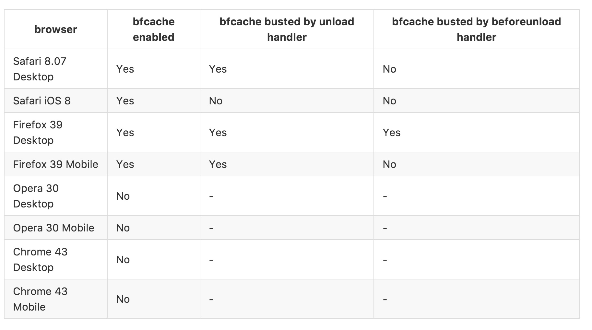

# [fit]:rewind: bfcache :fast_forward:

---
# :rewind: bfcache :fast_forward:

 - what is bfcache
 - why is it cool
 - story about a pitfall
 - how to take control

---

# bfcache
## :rewind: back fowards :fast_forward:


^
- when navigating page is entirely reconstructed
- including js objects, timers etc.
- like never left
- no window load / domcontentloaded event fired

---
# example use case
[Infinite Kittens!](http://localhost:2222/kitten/)

---
# take control

```javascript
window.addEventListener('unload', () => {});

```
^
dom can be manipulated

---
# 📱 mobile 📱


# :cry: :sob: :scream: :crying_cat_face:

---

# take control

```javascript

window.addEventListener('pageshow', (event) => {
  if (event.persisted) {
    // loaded from bf cache
    // restore desired state
    // window.location.reload()? :P
  }
});


```
^
dom can be manipulated

---

# [fit] 😻 Thanks 😻

---
---
---




---
